<h1 align="center">Hi 👋, I'm Truong Giang</h1>

<h3 align="center">
  Front-end Developer · Full-stack Developer · Open Source Enthusiast
</h3>

  
  
  

  

  
  

---

## 👨‍💻 About Me

- 👋 Hi, I'm **Truong Giang**
- 💻 I'm a **Front-end Developer**
- 🚀 I enjoy building modern and scalable web applications
- ⚛️ My main ecosystem is **React / Next.js / TypeScript**
- 🧩 I also work with backend technologies and databases
- ☁️ Interested in cloud, DevOps and modern development workflows
- 🎨 I care about clean UI, reusable components and developer experience
- 🌐 Portfolio: **[truonggiang.life](https://truonggiang.life/)**
- 📂 GitHub: **[github.com/giang-cat-luong](https://github.com/giang-cat-luong)**

---

## 🛠️ Tech Stack

### 🎨 Frontend

  
  
  
  
  
  
  
  
  
  
  
  

### ⚙️ Backend & Database

  
  
  
  
  
  
  

### ☁️ Cloud / DevOps / Tools

  
  
  
  
  
  

### 📱 Mobile / Other

  
  
  
  

### 🎨 Design

  
  

---

## 🌐 Portfolio

  

---

## 📊 GitHub Stats

  

  

  

---

## 🏆 GitHub Trophies

  

---

## 📈 Contribution Activity

  

---

## 🤝 Connect With Me

  

  

  

---

## ☕ Support Me

  

---

  

<!-- 

  <b>💻 Keep coding · 🚀 Keep learning · ✨ Keep building</b>

 -->

  <i>Thanks for visiting my profile! 🚀</i>

  © 2026 Truong Giang. All rights reserved.

